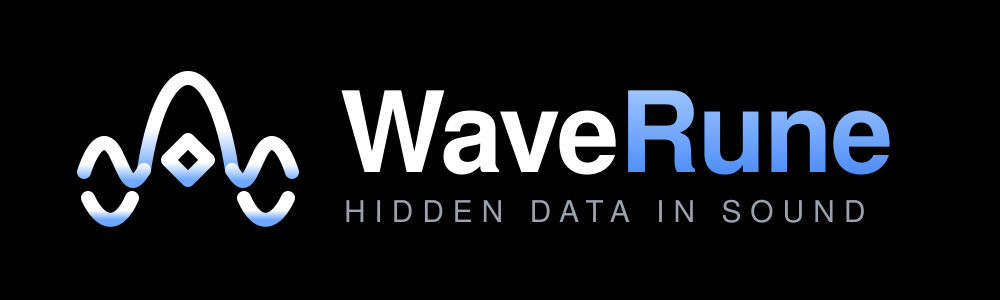

<p align="center">
  
</p>

<p align="center">
  Audio watermarking for Node.js, Bun, and the browser.
</p>

<p align="center">
  <a href="https://github.com/hamedniroomand/waverune/actions/workflows/ci.yml"></a>
  <a href="LICENSE"></a>
</p>

<p align="center">
  <a href="https://hamedniroomand.github.io/waverune/"><strong>Try the demo</strong></a> ·
  <a href="docs/api.md">API reference</a> ·
  <a href="docs/reliability-report.md">Measured results</a> ·
  <a href="CONTRIBUTING.md">Contributing</a>
</p>

<p align="center">
  
</p>

WaveRune embeds a 32-bit identifier in WAV audio and reads it back using a
key. Detection does not need the original recording. Use it to experiment
with audio identification, add watermarks to a WAV workflow, or study a
small, inspectable signal-processing implementation.

The package has **zero runtime dependencies**, includes TypeScript declarations,
and provides both a library and a command-line tool. The browser demo processes
files locally; nothing is uploaded.

Recovery depends on the audio. In the recorded-audio benchmark, the current
detector recovered 24 of 27 clean, full-length trials across nine files.
Short clips and edited audio are less reliable. See [limits and measured results](#limits-and-measured-results)
before relying on it in a workflow.

## Install

```bash
npm install waverune
```

For the command-line tool:

```bash
npm install -g waverune
# Or run without a global installation:
npx waverune --help
```

Bun users can use `bun add waverune` and `bunx waverune`.

### One-command install, no Node or Bun

Install the standalone CLI without installing a JavaScript runtime.

**macOS and Linux**

```bash
# macOS and Linux: installs ~/.local/bin/waverune
curl -fsSL https://raw.githubusercontent.com/hamedniroomand/waverune/main/install.sh | bash
```

**Windows (x64)**

```powershell
# Installs %LOCALAPPDATA%\Programs\waverune\waverune.exe and adds it to your user PATH
powershell -ExecutionPolicy Bypass -c "irm https://raw.githubusercontent.com/hamedniroomand/waverune/main/install.ps1 | iex"
```

Both scripts download the archive for your platform from the latest
[GitHub Release](https://github.com/hamedniroomand/waverune/releases), check
its SHA-256 against the release's `SHA256SUMS.txt`, and install the executable.
The Bun runtime is included in the executable.

On macOS and Linux, the installer prints a command to add the install directory
to `PATH` if needed. Add that line to your shell profile and open a new terminal.
On Windows, the installer updates your user `PATH`; open a new terminal to use it.
Then check the installation:

```bash
waverune --version
waverune --help
```

<details>
<summary>Choose a version or installation directory</summary>

Set these environment variables before running the installer:

| Variable           | Purpose                                   | Default                                                                      |
| ------------------ | ----------------------------------------- | ---------------------------------------------------------------------------- |
| `WAVERUNE_VERSION` | Release tag to download, such as `v0.3.1` | Latest release                                                               |
| `WAVERUNE_BIN_DIR` | Directory for the executable              | `~/.local/bin` on macOS/Linux; `%LOCALAPPDATA%\Programs\waverune` on Windows |

For example, on macOS or Linux, pass the settings to `bash`, which runs the installer:

```bash
curl -fsSL https://raw.githubusercontent.com/hamedniroomand/waverune/main/install.sh | WAVERUNE_VERSION=v0.3.1 WAVERUNE_BIN_DIR="$HOME/.local/bin" bash
```

In PowerShell, set the variables in the current session:

```powershell
$env:WAVERUNE_VERSION = "v0.3.1"
$env:WAVERUNE_BIN_DIR = "$env:LOCALAPPDATA\Programs\waverune"
irm https://raw.githubusercontent.com/hamedniroomand/waverune/main/install.ps1 | iex
```

The installers need a release of v0.3.1 or later. Earlier releases ship the
executables uncompressed, without the archives that the installers download.
Run the installer again to update or replace an existing installation. If you
previously set `WAVERUNE_VERSION`, set it to `latest` to get the newest release.

</details>

### Runtime and platform support

| Environment            | Support                                          |
| ---------------------- | ------------------------------------------------ |
| Node.js                | 22 or later; CI tests Node.js 22 and 24          |
| Bun                    | 1.4 or later                                     |
| Browser demo           | Local WAV processing, up to 120 seconds per file |
| Standalone executables | macOS ARM64/x64, Linux ARM64/x64, Windows x64    |

The package is ESM only. Standalone executables are published with each
[GitHub Release](https://github.com/hamedniroomand/waverune/releases) as
`waverune-<os>-<arch>.tar.gz` (macOS, Linux) and `waverune-windows-x64.zip`,
each holding one executable that embeds its runtime; the install scripts above
fetch and verify them for you.

## Quick start

### JavaScript and TypeScript

Embed an identifier, save the file, and verify the saved audio:

```ts
import { detect, embed, readWavFile, writeWavFile } from 'waverune';

const key = 'my-watermark-key';
const payload = 42n;
const original = await readWavFile('input.wav');

const marked = embed(original, { key, payload });
await writeWavFile('marked.wav', marked);

const saved = await readWavFile('marked.wav');
const result = detect(saved, { key });

if (result.detected && result.payload === payload) {
  console.log('Verified watermark:', result.payload.toString());
} else {
  console.log('The saved file did not recover the requested identifier.');
}
```

The default payload is an unsigned 32-bit integer (`0n` to `4294967295n`).
Keep the key to detect the watermark later. `embed` returns a new audio buffer
without changing the input.

Use `decodeWav` and `encodeWav` for byte arrays, or `PerceptualWatermarker`
for custom settings. See the [API reference](docs/api.md) for options, errors,
and detection diagnostics.

### Command line

```bash
waverune embed input.wav -o marked.wav --id 42 --key my-watermark-key
waverune detect marked.wav --key my-watermark-key
waverune metrics input.wav marked.wav
```

`embed` reads the saved file back and checks that the recovered identifier
matches the one requested. If verification fails, it reports the failure and
keeps the output file for inspection. Add `--json` for machine-readable output.

| Exit code | Meaning                                                                  |
| --------- | ------------------------------------------------------------------------ |
| `0`       | Command succeeded; detection accepted a watermark, or embedding verified |
| `1`       | Invalid input or another error                                           |
| `2`       | Detection did not accept a watermark                                     |
| `3`       | Embedding completed, but the saved file failed verification              |

See the [CLI reference](docs/api.md#cli) for all commands and flags.

### Browser demo

[Open the demo](https://hamedniroomand.github.io/waverune/), choose a WAV file,
and enter a key. Embed a new identifier to compare and download the output,
or detect a watermark in an existing file. A blank identifier generates a random one.

The demo accepts files up to 120 seconds. Processing can pause the page,
especially for longer or stereo recordings. The library and CLI do not impose
this duration cap.

## Limits and measured results

WaveRune uses classical signal processing: a keyed signal is spread across
frequency slots under a simplified masking model, then recovered through
spectral correlation. It needs no model downloads. Read [how it works](docs/how-it-works.md)
for the algorithm and acceptance rule.

The following are recorded benchmark results for the v0.3 detector, not
recovery guarantees for other recordings:

| Test set                                                               | Result                      |
| ---------------------------------------------------------------------- | --------------------------- |
| Clean synthetic audio, 20 key/payload pairs on each of two fixtures    | 40/40 exact recoveries      |
| The same synthetic trials after a 16-bit WAV round trip                | 40/40 exact recoveries      |
| Synthetic sample-rate conversions through macOS Core Audio             | 50/50 exact recoveries      |
| Clean recorded audio, three pairs across nine files                    | 24/27 exact recoveries      |
| Prefix removal on eligible recorded files                              | 119/119 exact recoveries    |
| Recorded-audio excerpts of 5 seconds or less                           | 115/329 exact recoveries    |
| Synthetic rejection tests with unmarked audio, wrong keys, and silence | 0 acceptances in 585 trials |

The [reliability report](docs/reliability-report.md) includes the inputs,
commands, per-file results, and comparisons with the previous detector.

- **Test your own audio.** Short recordings, noise, clipping, and other edits
  can prevent recovery. Recorded-audio excerpts under three seconds rarely
  recovered in the measured corpus.
- **WAV only.** The codec supports 16-, 24-, and 32-bit PCM and 32-bit float.
  MP3, AAC, Opus, and video processing are outside the package's scope.
- **Audibility has not been validated by listening tests.** The masking model
  is simplified, and some measured spectral cells exceed its threshold.
- **A watermark is not proof of ownership or authentication.** Anyone with
  the key can embed one. The checksum checks decoding integrity.
- **False acceptance remains possible.** No wrong payload was accepted in
  the reported v0.3 trials; the previous detector accepted one on a real-audio
  excerpt. A finite test set does not establish a false-acceptance rate.
- **Scores are diagnostic.** `correlationScore` is not a probability. Acceptance
  requires the sync pattern and checksum to match exactly.

## Development

Use Bun for installation, testing, and builds:

```bash
git clone https://github.com/hamedniroomand/waverune.git
cd waverune
bun install
bun run demo
```

The local demo runs at `http://localhost:3000`. To build its self-contained
HTML file, run `bun run demo:build`; the output is `dist-demo/index.html`.

```bash
bun test
bun run typecheck
bun run lint
bun run format:check
bun run build
bun run test:node
bun run test:interop
bun run check:pack
```

`bun run demo:gif` re-renders the terminal recording at the top of this file
from `assets/demo.tape`. It needs [vhs](https://github.com/charmbracelet/vhs)
0.11.0; version 0.12.0 exits without writing a file. The recording installs
the published package with `npm install -g waverune`.

`bun run build:binaries` cross-compiles the standalone executables into
`release/`. The release workflow runs it on every version tag, compresses the
executables, writes `SHA256SUMS.txt`, and uploads them to the GitHub Release
that the install scripts read.

The test suite takes several minutes. Resampling tests require `sox` or
macOS `afconvert`. If neither is available, explicitly skip that check with
`WAVERUNE_ALLOW_SKIP_RESAMPLE=1 bun test`.

The [contribution guide](CONTRIBUTING.md) covers the project layout, validation,
and useful details to include in bug reports. Benchmark commands and methodology
are in the [reliability report](docs/reliability-report.md).

## Contributing

Bug reports, documentation improvements, and tests with reproducible audio
cases are welcome. Check [existing issues](https://github.com/hamedniroomand/waverune/issues)
or read [CONTRIBUTING.md](CONTRIBUTING.md) to get started.

If WaveRune is useful to you, a GitHub star helps other developers find it.

## Acknowledgments

WaveRune draws inspiration from [Perth](https://github.com/resemble-ai/Perth),
particularly the idea of spreading watermark energy under a masking threshold.
It is an independent DSP implementation and is not compatible with Perth's
watermark format.

## License

[MIT](LICENSE), by Hamed Niroomand.
